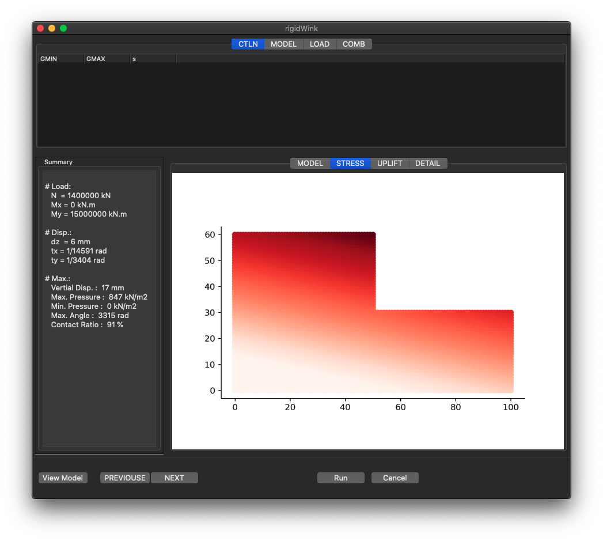

# rigidWink

uplift analysis by winkler rigid plate model



# Feature
- Uplift analysis by convergent calculation
- Rigid plate & Winkler Model
- Capable of using excel format file
- Making pdf report

# Souse Code

``` shell
> tree.
├── db
│   ├── detail.txt
│   ├── model.png
│   ├── result.png
│   ├── result.txt
│   └── uplift.png
├── gui.py
├── gui.wxg
├── main.py
├── rigidWink.py
```
# Usage

move your dir, then

``` shell
>mkdir db
>python3 main.py
```

after that,
- click file -> load sample
- push "View Model" or "Run" button
