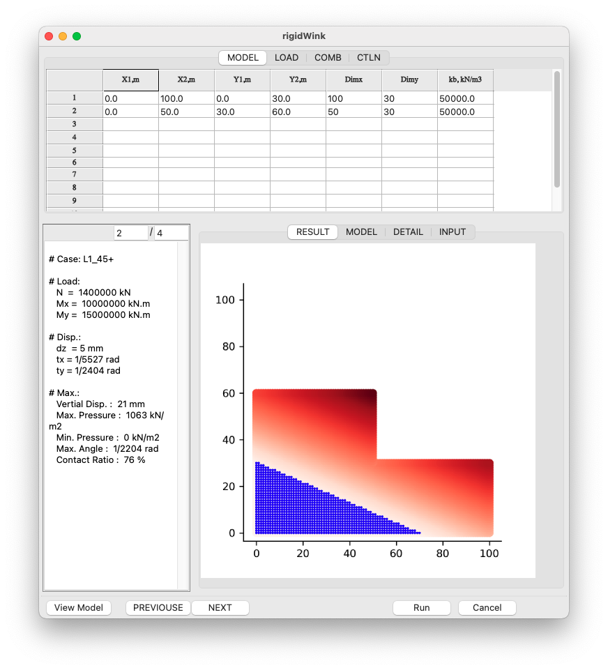
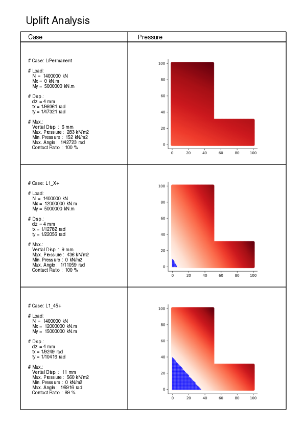

# rigidWink

uplift analysis by winkler rigid plate model



# Features
- Uplift analysis by convergent calculation
- Rigid plate & Winkler Model
- Capable of using excel format file
- Make pdf report




# Souse Code

``` shell
> tree.
├── db
│   ├── detail.txt
│   ├── model.png
│   ├── result.png
│   ├── result.txt
├── gui.py
├── gui.wxg
├── main.py
├── rigidWink.py
├── report.py
```
# Usage

## pip
``` shell
>pip install numpy
>pip install matplotlib
>pip install reportlab
>pip install openpyxl
>pip install wxpython
```
## how to run
move your dir, then

``` shell
>mkdir db
>python3 main.py
```

after that,
- click file -> load sample
- push "View Model" or "Run" button

## For Windows

``` DOS
> pyinstaller main.py --onefile --noconsole --icon=images/plate.ico
> ./dist/main/main.exe
```

Check Release, and click main/rigidWink.exe!
